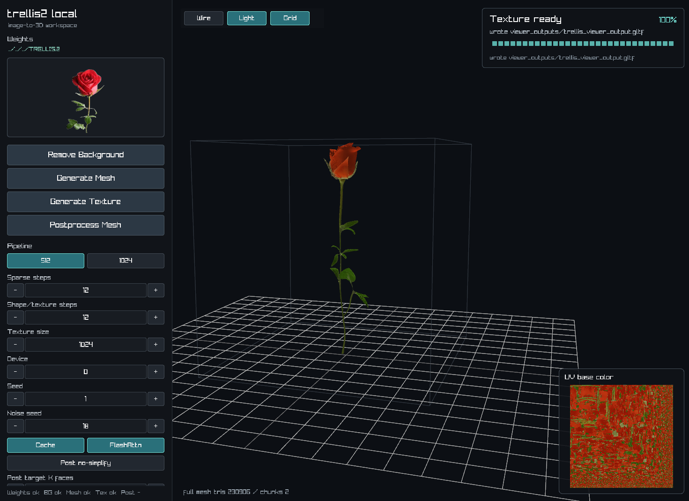

<p align="center">
  <samp>
&nbsp;&nbsp;_______&nbsp;____&nbsp;&nbsp;_____&nbsp;_&nbsp;&nbsp;&nbsp;&nbsp;&nbsp;_&nbsp;&nbsp;&nbsp;&nbsp;&nbsp;___&nbsp;____&nbsp;&nbsp;____&nbsp;&nbsp;&nbsp;&nbsp;____<br>
&nbsp;|__&nbsp;&nbsp;&nbsp;__|&nbsp;&nbsp;_&nbsp;\|&nbsp;____|&nbsp;|&nbsp;&nbsp;&nbsp;|&nbsp;|&nbsp;&nbsp;&nbsp;|_&nbsp;_/&nbsp;___||___&nbsp;\&nbsp;&nbsp;/&nbsp;___|<br>
&nbsp;&nbsp;&nbsp;&nbsp;|&nbsp;|&nbsp;&nbsp;|&nbsp;|_)&nbsp;|&nbsp;&nbsp;_|&nbsp;|&nbsp;|&nbsp;&nbsp;&nbsp;|&nbsp;|&nbsp;&nbsp;&nbsp;&nbsp;|&nbsp;|\___&nbsp;\&nbsp;&nbsp;__)&nbsp;||&nbsp;|<br>
&nbsp;&nbsp;&nbsp;&nbsp;|&nbsp;|&nbsp;&nbsp;|&nbsp;&nbsp;_&nbsp;&lt;|&nbsp;|___|&nbsp;|___|&nbsp;|___&nbsp;|&nbsp;|&nbsp;___)&nbsp;|/&nbsp;__/&nbsp;|&nbsp;|___<br>
&nbsp;&nbsp;&nbsp;&nbsp;|_|&nbsp;&nbsp;|_|&nbsp;\_\_____|_____|_____|___|____/|_____(_)____|<br>
<br>
&nbsp;&nbsp;&nbsp;&nbsp;&nbsp;&nbsp;&nbsp;&nbsp;&nbsp;&nbsp;&nbsp;&nbsp;&nbsp;&nbsp;&nbsp;&nbsp;&nbsp;trellis2.c&nbsp;image-to-3D&nbsp;pipeline
  </samp>
</p>

<p align="center">
  
</p>

`trellis2.c` 是 TRELLIS.2 图像转 3D 的原生推理工具，支持 CUDA 和 Vulkan。主要命令是 `trellis-image-to-gltf`。

## 编译

带子模块克隆：

```sh
git clone --recursive git@github.com:Wimacs/trellis2.c.git
cd trellis2.c
```

如果克隆时没有加 `--recursive`，再执行：

```sh
git submodule update --init --recursive
```

CUDA：

```sh
cmake -S . -B build -DTRELLIS2_C_BACKEND=cuda
cmake --build build -j
ctest --test-dir build --output-on-failure
```

Vulkan：

```sh
cmake -S . -B build-vulkan -DTRELLIS2_C_BACKEND=vulkan
cmake --build build-vulkan -j
```

Windows CUDA：

```powershell
cmake -S . -B build-win -G "Visual Studio 17 2022" -A x64 -DTRELLIS2_C_BACKEND=cuda -DCMAKE_CUDA_ARCHITECTURES=89
cmake --build build-win --config Release
ctest --test-dir build-win -C Release --output-on-failure
```

Windows Vulkan：

先安装 Vulkan SDK。

```powershell
cmake -S . -B build-win-vulkan -G "Visual Studio 17 2022" -A x64 -DTRELLIS2_C_BACKEND=vulkan
cmake --build build-win-vulkan --config Release
ctest --test-dir build-win-vulkan -C Release --output-on-failure
```

## 下载权重

Hugging Face：

```sh
python3 tools/download_weights.py --source huggingface
```

ModelScope：

```sh
python3 tools/download_weights.py --source modelscope
```

会下载 TRELLIS.2、DINOv3 和 BiRefNet 背景去除模型：

```text
../TRELLIS.2/
|-- TRELLIS.2-4B/
|-- dinov3-vitl16-pretrain-lvd1689m/
`-- BiRefNet/
    `-- BiRefNet-F16.gguf
```

## 使用

Linux：

```sh
./build/trellis-image-to-gltf \
  --model ../TRELLIS.2/TRELLIS.2-4B \
  --dino ../TRELLIS.2/dinov3-vitl16-pretrain-lvd1689m \
  --birefnet ../TRELLIS.2/BiRefNet/BiRefNet-F16.gguf \
  --image example_image/T.png \
  --gltf output.glb
```

Windows：

```powershell
.\build-win\Release\trellis-image-to-gltf.exe `
  --model ..\TRELLIS.2\TRELLIS.2-4B `
  --dino ..\TRELLIS.2\dinov3-vitl16-pretrain-lvd1689m `
  --birefnet ..\TRELLIS.2\BiRefNet\BiRefNet-F16.gguf `
  --image example_image\T.png `
  --gltf output.glb
```

Windows Vulkan 构建使用：

```powershell
.\build-win-vulkan\Release\trellis-image-to-gltf.exe `
  --backend vulkan `
  --model ..\TRELLIS.2\TRELLIS.2-4B `
  --dino ..\TRELLIS.2\dinov3-vitl16-pretrain-lvd1689m `
  --birefnet ..\TRELLIS.2\BiRefNet\BiRefNet-F16.gguf `
  --image example_image\T.png `
  --gltf output.glb
```
